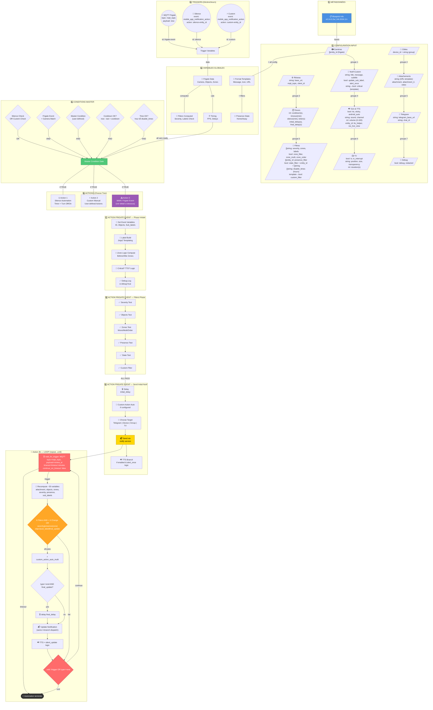
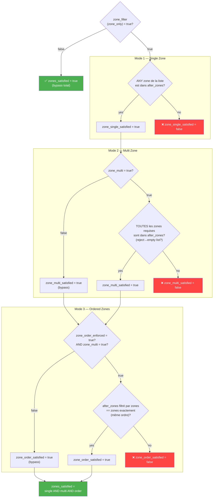

# Blueprint Frigate Notifications — Analyse Architecturale

**Blueprint:** SgtBatten/Stable.yaml (v0.14.0.2w)
**Contexte:** Préparation refonte Go
**Date:** 7 mars 2026

---

## 🏗️ Architecture Globale



---

## 📊 Résumé des 9 Briques Principales

| # | Brique | Rôle | Complexité | Lignes YAML |
| --- | -------- | ------ | ----------- | ------------ |
| **1** | **Métadonnées** | Info blueprint (version, HA min, auteur, source_url) | ⭐ Trivial | ~10 |
| **2** | **Configuration Input** | 7 groupes d'inputs collapse (Caméras, Targets, Attachements, etc.) | ⭐⭐⭐⭐⭐ **ÉNORME** | ~1000 |
| **3** | **Triggers** | 3 déclencheurs (MQTT Frigate, Silence user, Custom action) | ⭐⭐ Simple | ~20 |
| **4** | **Variables** | ~50 variables calculées (Jinja2 templates pour filters, format, timing) | ⭐⭐⭐⭐ Prise de tête | ~200 |
| **5** | **Conditions Master** | 7 filtres AND-ésés (Severity, Objects, Zones, Presence, State, Time, Custom) | ⭐⭐⭐ Moyen | ~40 |
| **6** | **Action Choose Tree** | 3 branches (Silence, Custom Auto, Frigate Event) | ⭐⭐ Simple | ~30 |
| **7-9** | **Frigate Event Action** | ⚡ LE cœur : INIT → FILTERS → SEND notif + **BOUCLE UPDATES** | ⭐⭐⭐⭐⭐ **CRITIQUE** | ~700 |
| **10** | **Loop Repeat** | Wait-for-MQTT + Recompute + Send Updates (peut boucler indéfiniment) | ⭐⭐⭐⭐ Complexe | ~400 |

**Total:** ~2400 lignes YAML

---

## 🎯 Détail des Briques pour Refonte Go

### 1️⃣ Métadonnées

```yaml
blueprint:
  name: "Frigate Notifications (0.14.0.2w)"
  author: "SgtBatten"
  homeassistant:
    min_version: "2024.11.0"
  description: "..."
  domain: "automation"
  source_url: "https://raw.githubusercontent.com/..."
```

**En Go :** Simple struct avec version + metadata. ✅

---

### 2️⃣ Configuration Input (`input`)

**7 groupes collapse :**

#### A. Sélection Caméras

- `camera`: entités Frigate (multiple)
- `notify_device`: device mobile (single)

#### B. Notification Targets

- `notify_group`: groupe notif ou Android/Fire TV
- `base_url`: URL HA externe (http/https)
- `mqtt_topic`: topic MQTT Frigate

#### C. Customisation Notif

- `title`, `message`, `subtitle`
- `critical`: boolean ou template Jinja2
- `attachment`, `attachment_2`: URL images/GIF
- `video`: URL vidéo (mp4, m3u8)
- `icon`, `color`, `sound`, `volume`
- `update_sub_label`: boolean
- `alert_once`: boolean
- `tts`, `tts_helper`: TTS config

#### D. Filtres

- `review_severity`: alert | detection
- `zone_filter`, `zones` (list)
- `zone_multi`, `zone_order_enforced`: multi-zone logic
- `labels`: object filter (person, dog, car, etc.)
- `presence_filter`: entities
- `state_filter`: entity + states
- `disable_times`: hours blacklist
- `custom_filter`: Jinja2 template

#### E. Timers

- `cooldown`, `timeout`, `silence_timer`
- `loiter_timer`, `initial_delay`, `final_delay`

#### F. Actions & URLs

- `tap_action`, `url_1/2/3`: URLs buttons
- `button_1/2/3`: textes buttons
- `custom_action_manual`, `custom_action_auto`, `custom_action_auto_multi`

#### G. TV & Telegram

- `tv`, `tv_position`, `tv_size`, `tv_duration`, `tv_transparency`, `tv_interrupt`
- `telegram_base_url`, `notify_telegram_chat_id`

#### H. Debug

- `debug`, `redacted`

**En Go :** Monstres structs imbriquées + YAML unmarshalling. Peut être amélioré avec une *DSL déclarative* simple. ⚠️

---

### 3️⃣ Triggers

```yaml
triggers:
  - trigger: mqtt
    topic: '{{mqtt_topic}}'
    payload: new
    value_template: '{{value_json[''type'']}}'
    id: frigate-event
  - trigger: event
    event_type: mobile_app_notification_action
    event_data:
      action: silence-{{ this.entity_id }}
    id: silence
  - trigger: event
    event_type: mobile_app_notification_action
    event_data:
      action: custom-{{ this.entity_id}}
    id: custom
```

**3 déclencheurs :**

1. **MQTT** : nouveau message MQTT Frigate → ID `frigate-event`
2. **Silence** : user clique bouton "Silence" → ID `silence`
3. **Custom** : user clique bouton "Custom Action" → ID `custom`

**En Go :** Event multiplexer avec Router basé sur `trigger.id`. ✅

---

### 4️⃣ Variables Globales (~200 lignes)

**Calculées une fois au boot de l'automation :**

```text
input_camera → camera_name
input_severity → severity (from MQTT)
base_url → strip trailing /
camera → extracted from MQTT
objects → from Frigate event
zones → from Frigate event
...
severity_satisfied: {{input_severity|select('in', severity)|list|length > 0}}
objects_satisfied: {{not labels|length or labels|select('in', objects)|list|length > 0}}
zone_multi_filter: {{zone_only and zone_multi and after_zones|length and zones and zones |reject('in', after_zones) |list |length == 0}}
...
```

**Jinja2 Hell 🔥** : D'énormes templates Jinja2 pour :

- Filtrer severités
- Fusionner objects/sub_labels
- Logic zones (mono vs multi vs ordered)
- Builder URLs dynamiques
- Formatter messages

**En Go :**

- Créer un **Jinja2 interpreter** ou wrapper (<https://github.com/uber/h2>)
- OU créer un **mini-DSL d'expression** custom (Go templates ?)
- OU appeler Jinja2 en tant que service externe

⚠️ **Critique pour refonte**

---

### 5️⃣ Conditions Master

Structure `condition: or > conditions: [ ... ]`

**Soit :**

1. `trigger.id == silence`, **OU**
2. `trigger.id == custom`, **OU**
3. `trigger.id == frigate-event` **ET** combinaisons de :
   - Camera Match
   - Master Condition (user input)
   - Cooldown
   - Disable Times

**En Go :** Condition tree evaluator avec short-circuit. ✅

---

### 6️⃣ Actions — Choose Tree

**3 branches :**

#### A. Silence Action

```yaml
- alias: Silence New Object Notifications
  conditions: [trigger.id == silence]
  sequence:
    - turn_off automation (stop_actions: false)
    - delay: silence_timer minutes
    - turn_on automation
```

#### B. Custom Manual Action

```yaml
- alias: Custom Action Manual
  conditions: [trigger.id == custom]
  sequence: !input custom_action_manual
```

#### C. Frigate Event (MAIN) ⚡

```yaml
- alias: Frigate Event
  conditions: [trigger.id == frigate-event]
  sequence: [ÉNORME - voir brique 7]
```

**En Go :** Simple if-else-if dispatcher. ✅

---

### 7️⃣⃣⃣ ACTION FRIGATE EVENT — Le Cœur

**3 phases :**

#### Phase A : Setup Event Variables

```yaml
- variables:
    event: '{{ trigger.payload_json }}'
    detections: '{{ event[''after''][''data''][''detections''] }}'
    review_id: '{{event[''after''][''id'']}}'
    id: '{{ detections[0] }}'
    objects: '{{ event[''after''][''data''][''objects''] }}'
    sub_labels: '{{ event[''after''][''data''][''sub_labels''] }}'
    label: " ... complex Jinja2 ... "
```

**Jinja2 Hell:** Label builder qui merge objects + sub_labels avec dedup et sort.

#### Phase B : Computed Filters

```yaml
any_zones_entered: '{{ zones | length == 0 or ((zones | select(''in'', after_zones) | list | length) > 0) }}'
zone_single_satisfied: ...
zone_multi_satisfied: ...
all_zones_entered: ...
ordered_zones_match: " ... complex loop ...  {{ ns.intersection == zones }}"
zones_satisfied: ...
```

#### Phase C : Debug Log

```yaml
- choose:
  - conditions: ['{{debug}}']
    sequence:
      - action: logbook.log
        data_template:
          name: "Frigate Notification"
          message: "DEBUG: ... 50+ lines of templated debug info ..."
```

#### Phase D : Master All-Filters Check

```yaml
- choose:
  - conditions:
      - condition: template
        value_template: '{{ severity_satisfied }}'
      - condition: template
        value_template: '{{ objects_satisfied }}'
      - ... (5 more filters)
    sequence: [SEND NOTIFICATIONS + LOOP]
```

---

### 9️⃣ Notification Send (Initial)

```yaml
- alias: Send Notification
  sequence:
  - choose:
    - conditions: '{{ telegram }}'        # Branch A: Telegram
      sequence:
        - action: telegram_bot.send_photo
          data: { target, caption, url }
    - conditions: '{{ not notify_group_target }}'  # Branch B: Direct device
      sequence:
        - device_id: !input notify_device
          domain: mobile_app
          type: notify
          data: { title, message, tag, group, color, ... (30 fields) }
    - conditions: '{{ tv }}'              # Branch C: TV Notify
      sequence:
        - action: notify.{{ notify_group_target }}
          data: { ... with TV-specific fields }
    default:                             # Branch D: Generic group
      - action: notify.{{ notify_group_target }}
        data: { ... mixed mobile + TV }
  - if: '{{tts and (...)}}'
    then:                               # Branch E: TTS
      sequence:
        - choose: [...]
        - action: input_text.set_value   # Store TTS IDs for alert_once
```

**Routing complexity:** 5 branches pour reach Telegram, device, group, TV, ou TTS. Chacun a des champs customisés.

---

### 🔁 Loop — La Boucle Update

```yaml
- repeat:
    sequence:
    - wait_for_trigger:
      - trigger: mqtt
        topic: '{{mqtt_topic}}'
        payload: '{{ review_id }}'
        value_template: '{{ value_json[''after''][''id''] }}'
      timeout:
        minutes: '{{timeout}}'
      continue_on_timeout: false

    - variables:  # Recompute ALL variables from new MQTT event
        attachment_2: !input attachment_2
        attachment: '{{iif(attachment_2, attachment_2, attachment)}}'
        event: '{{ wait.trigger.payload_json }}'
        type: '{{event[''type'']}}'
        ... (30+ new computations)

    - choose:
      - conditions: [ALL 7 FILTERS PASS AGAIN]
        sequence:
          - choose:
            - conditions: '{{ custom_action_auto_multi | length > 0 }}'
              sequence: !input custom_action_auto_multi
          - delay: '{{final_delay}}'  # Only if type == 'end'
          - alias: Update Notification
            sequence:
              - choose: [TELEGRAM|DEVICE|TV|GROUP branches again]
```

**La boucle :**

1. Attend un nouvel event MQTT avec même `review_id`
2. Recalcule TOUTES les variables
3. Re-teste TOUS les filtres
4. Si OK + au moins 1 trigger de update (severity changed, presence changed, zone entered, object changed, sub_label changed, final update) → Send update
5. Boucle indéfiniment jusqu'à timeout

**En Go :**

- EventStore avec debounce + timeout
- Mutable state machine
- Repeat executor

---

## � Analyse Détaillée — Compléments Migration Go

### 📐 Zone Logic — Sous-diagramme dédié

La logique de filtrage par zones est la plus algorithmiquement complexe du blueprint. Elle combine 3 modes :



**En Go :** 3 fonctions pures chaînées : `checkZoneSingle(zones, afterZones)`, `checkZoneMulti(zones, afterZones)`, `checkZoneOrder(zones, afterZones)`, composées dans un `ZoneFilter.Evaluate()`. L'algorithme Ordered nécessite un `slices.Equal()` sur l'intersection (attention à l'ordre d'itération).

---

### 📋 Catalogue Jinja2 → Signatures Go

Chaque expression Jinja2 du blueprint avec son type Go cible :

| # | Variable | Expression Jinja2 | Type Go | Complexité |
| --- | ---------- | ------------------ | --------- | ------------ |
| 1 | `input_camera_name` | `input_camera\|expand\|map(attribute='attributes.camera_name')\|list` | `[]string` | ⭐⭐ HA API call |
| 2 | `camera` | `trigger.payload_json['after']['camera']` | `string` | ⭐ JSON path |
| 3 | `camera_name` | `camera \| replace('_', ' ') \| title` | `string` | ⭐ `strings.ReplaceAll` + `cases.Title` |
| 4 | `severity` | `trigger.payload_json['after']['severity']` | `string` | ⭐ JSON path |
| 5 | `base_url` | `input_base_url.rstrip('/')` | `string` | ⭐ `strings.TrimRight` |
| 6 | `telegram_base_url` | `input \| rstrip('/') if input else base_url` | `string` | ⭐ ternaire simple |
| 7 | `client_id` | `if not id → '' ; elif '/' not in id → '/' + id ; else id` | `string` | ⭐ if/else |
| 8 | `notify_group_target` | `group \| lower \| regex_replace('^notify\.', '') \| replace(' ','_')` | `string` | ⭐⭐ `regexp.ReplaceAllString` |
| 9 | `telegram` | `true if (chat_id \| length > 0) else false` | `bool` | ⭐ `len(chatID) > 0` |
| 10 | `labels` | `input_labels \| list \| lower` | `[]string` | ⭐ `strings.ToLower` en boucle |
| 11 | `fps` | `states('sensor.' + camera + '_camera_fps')\|int(5)` | `int` | ⭐⭐ HA state query |
| 12 | `volume` | `(1 * input_volume\|int(100))/100` | `float64` | ⭐ arithmétique |
| 13 | `severity_satisfied` | `input_severity\|select('in', severity)\|list\|length > 0` | `bool` | ⭐ `slices.Contains` |
| 14 | `objects` | `payload['after']['data']['objects']` | `[]string` | ⭐ JSON path |
| 15 | `objects_satisfied` | `!labels.len OR labels∩objects OR 'person-verified' in objects` | `bool` | ⭐⭐ intersection set |
| 16 | `initial_home` | `presence ≠ '' AND expand→selectattr(state=home)→len ≠ 0` | `bool` | ⭐⭐⭐ HA API multi-entity |
| 17 | `state_satisfied` | `!state_only OR states(entity)\|lower in filter` | `bool` | ⭐⭐ HA state query |
| 18 | `zone_multi_filter` | `zone_only AND zone_multi AND after_zones.len AND zones−after_zones==∅` | `bool` | ⭐⭐ set difference |
| 19 | `label` (event) | **Mega template** : boucle objects, filtre '-verified', merge sub_labels, unique+sort+join+title | `string` | ⭐⭐⭐⭐ Le plus complexe |
| 20 | `zone_single_satisfied` | `zones.len==0 OR any(zone in after_zones)` | `bool` | ⭐ any check |
| 21 | `zone_multi_satisfied` | `zones.len==0 OR all(zone in after_zones)` | `bool` | ⭐ all check |
| 22 | `ordered_zones_match` | boucle + intersection ordonnée + comparaison | `bool` | ⭐⭐⭐ ordered slice compare |
| 23 | `critical` | `true if input == 'true' OR input == True else false` | `bool` | ⭐ type coercion |
| 24 | `silent_update` | `alert_once OR (!presence_chg AND !zone_upd AND !obj_upd AND !sub_lbl_upd)` | `bool` | ⭐⭐ multi-condition |
| 25 | `home` (loop) | `presence\|reject('')\|is_state('home')\|list\|length != 0` | `bool` | ⭐⭐⭐ HA API multi |
| 26 | `presence_changed` | `presence\|expand\|map(last_changed)\|select(gt, start_time)\|len != 0` | `bool` | ⭐⭐⭐ HA API + time compare |
| 27 | `entered_new_zones` | `!zone_only AND after_zones.len > last_zones.len` | `bool` | ⭐ int compare |
| 28 | `entered_new_filter_zones` | `zone_only AND zones.len>0 AND new∩zones > last∩zones` | `bool` | ⭐⭐ set+count |
| 29 | `sub_label_updated` | `update_sub_label AND sub_labels != before_sub_labels` | `bool` | ⭐ slice compare |
| 30 | `object_updated` | `old_objects∩labels.len != objects∩labels.len` | `bool` | ⭐⭐ set intersection count |

**Statistiques :** 6 expressions nécessitent des appels HA API (#1, #11, #16, #17, #25, #26). L'expression #19 (`label`) est la plus complexe à porter.

---

### 🔇 `silent_update` et `loitering` — Logiques cachées

#### `silent_update` (actif)

Calculé dans la boucle update pour décider si le son est coupé :

```text
silent_update = alert_once
                OR (NOT presence_changed
                    AND NOT zone_updated
                    AND NOT object_updated
                    AND NOT sub_label_updated)
```

**Impact :** Si `silent_update = true` → le son iOS passe à `'none'`, le volume à `0`, et Android respecte `alert_once`. Seuls les changements "significatifs" produisent du son.

**En Go :** Un simple booléen recalculé à chaque itération de la boucle. Mais attention : il dépend de `presence_changed`, `zone_updated`, `object_updated`, `sub_label_updated` qui sont eux-mêmes des comparaisons entre l'état précédent et le courant → nécessite de maintenir un `previousState` dans la boucle.

#### `loitering` (dead code / futur)

Défini dans les variables globales :

```yaml
loitering: false
loiter_timer: !input loiter_timer
```

`loitering` est **hardcodé à `false`** et n'est jamais redéfini nulle part dans le blueprint. L'input `loiter_timer` existe mais n'est utilisé que dans le TTS tag : `'{{id}}{{''-loitering-tts'' if loitering}}'` — qui ne produit jamais rien puisque `loitering` est faux.

**Verdict :** Dead code préparatoire pour une future feature. **En Go : ne pas porter**, ou prévoir un placeholder commenté.

---

### 📨 Différences de payload par branche notification

4 branches de dispatch, chacune avec des champs distincts :

| Champ | 📡 Telegram | 📱 Device (mobile) | 📺 TV | 📱 Group (default) |
| ------- | :-----------: | :-------------------: | :-----: | :-------------------: |
| **Service** | `telegram_bot.send_photo/video` | `device notify (mobile_app)` | `notify.{group}` | `notify.{group}` |
| `title` | — | ✅ | ✅ | ✅ |
| `message` | `caption` | ✅ | ✅ | ✅ |
| `tag` | — | ✅ | ✅ | ✅ |
| `group` | — | ✅ | ✅ | ✅ |
| `color` | — | ✅ | ✅ | ✅ |
| `image` | `url` (photo) | ✅ | `url` dans `image{}` | ✅ |
| `video` | `url` (vidéo) | ✅ | ✅ | — |
| `attachment.url` | — | ✅ | ✅ | ✅ |
| `attachment.content-type` | — | ✅ | ✅ | ✅ |
| `clickAction` | — | ✅ | ✅ | ✅ |
| `push.sound` | — | ✅ | ✅ | ✅ |
| `entity_id` (live view) | — | ✅ | ✅ | ✅ |
| `actions[]` (3 buttons) | `inline_keyboard` | ✅ | ✅ | ✅ |
| `sticky` | — | ✅ | ✅ | ✅ |
| `channel` | — | ✅ | ✅ | ✅ |
| `car_ui` (Android Auto) | — | ✅ | ✅ | ✅ |
| `subtitle` | — | ✅ | ✅ | ✅ |
| **TV-specific** | | | | |
| `fontsize` | — | — | ✅ | ✅ (mixte) |
| `position` | — | — | ✅ | ✅ (mixte) |
| `duration` | — | — | ✅ | ✅ (mixte) |
| `transparency` | — | — | ✅ | ✅ (mixte) |
| `interrupt` | — | — | ✅ | ✅ (mixte) |
| `timeout` | — | — | `30` (hardcodé) | — |
| **Image spéciale TV** | — | — | Snapshot forcé (remplace GIF) | — |
| `alert_once` | — | — (initial) / ✅ (loop) | — (initial) / ✅ (loop) | — (initial) / ✅ (loop) |

**Points d'attention pour Go :**

- Telegram a un format complètement différent (pas de `data:`, `caption` au lieu de `message`, `inline_keyboard` au lieu de `actions`)
- TV force le snapshot même si un GIF est sélectionné : `attachment | replace('review_preview.gif','snapshot.jpg') | replace('event_preview.gif','snapshot.jpg')`
- Group (default) inclut les champs TV (`fontsize`, `position`...) pour supporter les groupes mixtes mobile+TV
- `alert_once` n'est PAS envoyé dans la notification initiale, seulement dans les updates de la boucle
- Telegram envoie `send_video` au lieu de `send_photo` quand `type == 'end'` ET `video` est défini

---

### ⚠️ Chemins d'erreur et cas limites

| Scénario | Comportement blueprint | Impact Go |
| ---------- | ---------------------- | ---------- |
| **MQTT timeout** (boucle) | `continue_on_timeout: false` → la boucle s'arrête immédiatement | `select` avec `time.After()` → `break` de la boucle |
| **Pas de match caméra** | Condition `Camera Match` bloque → automation ne s'exécute pas | Retour anticipé dans le handler |
| **Payload MQTT malformé** | Jinja2 retourne vide → variables sont `''` ou `[]` → filtres échouent silencieusement | En Go : parsing JSON strict → retourner une erreur explicite |
| **Entity introuvable** (presence/state) | `states()` retourne `'unavailable'` → `initial_home`/`state_satisfied` peuvent être faux-positifs | Gérer le cas `unavailable`/`unknown` comme erreur ou état par défaut |
| **`tts_helper` plein** | Troncature à 250 chars : `newIds[:250]` → anciens IDs perdus | Ring buffer ou TTL-based cleanup en Go |
| **Notification service indisponible** | Pas de retry, pas de catch → échec silencieux | Ajouter retry avec backoff + logging |
| **Cooldown race condition** | `mode: parallel` → 2 events simultanés peuvent passer le cooldown | En Go : `sync.Mutex` sur le timestamp `last_triggered`, ou channel serialisé |
| **`final_delay` après event end** | delay de `final_delay` secondes APRÈS le `end` → image potentiellement déjà supprimée par Frigate | Documenter le risque, éventuellement pré-fetch l'image |
| **Silence timer + HA restart** | Si HA redémarre pendant le silence timer → automation reste OFF | En Go : persister le timer state (fichier/redis) |

---

## �🚀 Points Clés pour Refonte Go

### Défis Majeurs

| Challenge | Severity | Solution Go |
| ----------- | ---------- | ------------ |
| **Jinja2 Templating** | 🔴 CRITQUE | Implémenter parser Jinja2 ou wrapper (cgo ?) ou mini-DSL |
| **Multi-branch Notify** | 🟡 Moyen | Notification Router avec factory pattern |
| **State Mutations in Loop** | 🟡 Moyen | Immutable value objects + fold over events |
| **Massive Config** | 🟡 Moyen | YAML unmarshaling + struct validation |
| **Filter Combinatorics** | 🟡 Moyen | Expression tree evaluator |
| **Async MQTT + Timeout** | 🟢 Facile | context.WithTimeout + channel select |

### Architecture Suggérée Go

```text
frigate-blueprint/
├── config.go          # YAML unmarshaling
├── variables.go       # Variable computation
├── conditions.go      # Filter evaluation
├── notifier.go        # Multi-backend notify
├── jinja/             # Jinja2 wrapper OR custom DSL
├── processor.go       # Main FSM
└── main.go
```

### Étapes d'Implémentation

1. **Parser YAML config** ✅
2. **Implement Variable Computer** (Jinja2 expressions) ⚠️
3. **Condition Evaluator** ✅
4. **Notification Router** ✅
5. **MQTT Event Loop** ✅
6. **State Machine** ✅

---

## 📚 Références

- **Blueprint source:** `blueprints/automation/SgtBatten/Stable.yaml`
- **Documentation Frigate:** <https://frigate.video/>
- **HA Automations:** <https://www.home-assistant.io/docs/automation/>

---

**Créé:** 7 mars 2026
**Pour:** Refonte en Go
