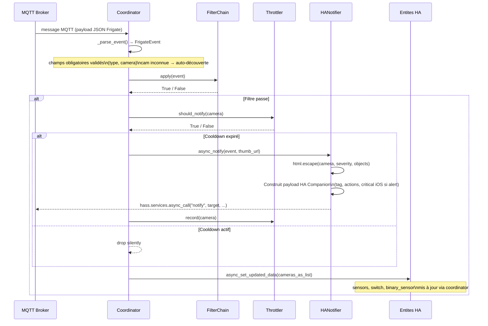

# Architecture — Frigate Event Manager

Intégration Home Assistant (HACS) écrite en Python asyncio.
Écoute les événements Frigate via le broker MQTT natif HA, filtre, throttle et dispatche vers les notifications et les entités HA.

## Vue d'ensemble

```mermaid
graph TB
    subgraph External["Systemes externes"]
        BROKER[("MQTT Broker")]
        FRIGATE["Frigate NVR"]
        HA_NOTIFY["HA Companion App"]
    end

    subgraph Integration["custom_components/frigate_event_manager"]
        COORD["coordinator.py\nFrigateEventManagerCoordinator\n(DataUpdateCoordinator — push MQTT)"]
        FILTER["filter.py\nFilterChain\n(ZoneFilter + LabelFilter + TimeFilter)"]
        THROTTLE["throttle.py\nThrottler\n(cooldown par caméra)"]
        NOTIFIER["notifier.py\nHANotifier\n(services HA Companion)"]
        REGISTRY["registry.py\nCameraRegistry\n(persistence JSON)"]
        STORE["event_store.py\nEventStore\n(ring buffer deque 200)"]

        subgraph Entities["Entites HA"]
            SENSOR["sensor.py\n3 sensors par camera"]
            SWITCH["switch.py\n1 switch par camera"]
            BINSENSOR["binary_sensor.py\n1 binary_sensor par camera"]
        end
    end

    subgraph Persistence["Persistence"]
        JSON[("frigate_em_state.json\nhass.config.path()")]
    end

    BROKER -->|"frigate/reviews (MQTT natif HA)"| COORD
    COORD -->|FrigateEvent| FILTER
    FILTER -->|accepte| THROTTLE
    THROTTLE -->|cooldown OK| NOTIFIER
    NOTIFIER -->|"notify.<target>"| HA_NOTIFY
    COORD -->|async_set_updated_data| Entities
    COORD -->|update| REGISTRY
    COORD -->|add| STORE
    REGISTRY -->|async_save / async_load| JSON
    SWITCH -->|"set_camera_enabled()"| COORD

    style External fill:#1a0a0a,stroke:#f85149
    style Integration fill:#0a1a2a,stroke:#58a6ff
    style Entities fill:#0a1a1a,stroke:#3fb950
    style Persistence fill:#1a1a0a,stroke:#d29922
```



## Flux de données



## Composants

### coordinator.py — FrigateEventManagerCoordinator

`DataUpdateCoordinator` en mode push MQTT uniquement (`update_interval=None`).

- **`async_start()`** : souscrit au topic MQTT via `mqtt.async_subscribe(hass, topic, cb)`. La reconnexion est gérée nativement par l'intégration MQTT de HA.
- **`async_stop()`** : désabonnement propre, appelé depuis `async_unload_entry`.
- **`_handle_mqtt_message()`** : callback MQTT (`@callback`), parse le payload, met à jour `_cameras: dict[str, CameraState]`, notifie les entités via `async_set_updated_data`.
- **`set_camera_enabled()`** : mutation du flag `enabled` d'une caméra, déclenché par le switch HA.
- **`_cameras_as_list()`** : sérialise les `CameraState` en `list[dict]` pour la compatibilité avec les entités.

Dataclasses exposées :

| Dataclass | Champs clés |
| --- | --- |
| `FrigateEvent` | `type`, `camera`, `severity`, `objects`, `zones`, `score`, `thumb_path`, `review_id`, `start_time`, `end_time` |
| `CameraState` | `name`, `last_severity`, `last_objects`, `event_count_24h`, `last_event_time`, `motion`, `enabled` |

### filter.py — FilterChain

Protocole `Filter` (méthode `apply(event) → bool`). Convention : liste vide = tout accepter.

| Filtre | Paramètre | Comportement |
| --- | --- | --- |
| `ZoneFilter` | `zone_multi: list[str]`, `zone_order_enforced: bool` | Toutes les zones requises présentes (ou sous-séquence ordonnée si `zone_order_enforced=True`) |
| `LabelFilter` | `labels: list[str]` | Au moins un objet de l'événement dans la liste |
| `TimeFilter` | `disabled_hours: list[int]`, `clock: Callable` | Bloque si l'heure locale courante est dans `disabled_hours`. Clock injectable pour les tests. |
| `FilterChain` | `filters: list[Filter]` | `all()` avec court-circuit au premier refus |

### registry.py — CameraRegistry

Registre en mémoire `dict[str, CameraState]` avec persistence JSON.

- Auto-découverte : toute caméra inconnue est créée avec `enabled=True`.
- Persistence dans `hass.config.path("frigate_em_state.json")`.
- Ecriture atomique : fichier `.tmp` + `os.replace()` (POSIX atomique).
- I/O disque déléguées à `hass.async_add_executor_job` (non-bloquant).

### event_store.py — EventStore

Ring buffer d'événements basé sur `collections.deque(maxlen=200)`.

- **`add(event)`** : ajoute un `EventRecord` avec timestamp = `start_time` si > 0.0, sinon `time.time()`.
- **`list(limit, severity)`** : retourne les événements les plus récents en tête, filtre optionnel par sévérité.
- **`stats()`** : fenêtre glissante 24h (`time.time() - 86400`), retourne `events_24h` et `alerts_24h`.

### throttle.py — Throttler

Anti-spam par caméra, séparation décision / enregistrement.

- **`should_notify(camera, now)`** : lecture seule — retourne True si aucune notification précédente ou cooldown écoulé.
- **`record(camera, now)`** : seul point de mutation — enregistre le timestamp de la dernière notification.
- Clock injectable pour les tests. Cooldown configurable (défaut : 60 s).

### notifier.py — HANotifier

Notifications HA Companion via `hass.services.async_call("notify", target, ...)`.

- `html.escape()` sur tous les champs dynamiques issus du payload Frigate (camera, severity, objects, review_id).
- **Tag** : `frigate_{camera}` pour le collapse des notifications par caméra.
- **Actions** : bouton "Voir le clip" avec URI Frigate ou lien Lovelace.
- **Critical iOS** : `push.sound.critical=1` uniquement si `severity == "alert"`.
- **thumb_url** : incluse dans `data["image"]` uniquement si format HTTP(S) valide.
- Exceptions `async_call` catchées et loggées, non re-levées.

## Entités HA par caméra

```mermaid
graph LR
    subgraph camera["Pour chaque camera decouverte"]
        A["sensor — Derniere severite\nunique_id: fem_{cam}_last_severity"]
        B["sensor — Dernier objet\nunique_id: fem_{cam}_last_object\nattribut: all_objects"]
        C["sensor — Evenements 24h\nunique_id: fem_{cam}_event_count_24h"]
        D["switch — Notifications\nunique_id: fem_{cam}_notifications"]
        E["binary_sensor — Mouvement\nunique_id: fem_{cam}_motion\ndevice_class: motion"]
    end

    style camera fill:#0a1a2a,stroke:#58a6ff
```



Toutes les entités héritent de `CoordinatorEntity` et ont `has_entity_name=True`.
Les données sont lues depuis `coordinator.data` (liste de dicts sérialisés par `CameraState.as_dict()`).

**Limitation connue** : les entités sont créées au démarrage de la plateforme. Si `coordinator.data` est vide (aucun événement MQTT reçu avant le setup), aucune entité n'est créée. Les caméras découvertes après le démarrage nécessitent un **reload de l'intégration**. La découverte dynamique post-démarrage est prévue en T-484.

## Séquence de démarrage

```mermaid
graph TD
    S1["1. async_setup_entry(hass, entry)"]
    S2["2. FrigateEventManagerCoordinator(hass, entry)\n    update_interval=None"]
    S3["3. hass.data[DOMAIN][entry_id] = coordinator"]
    S4["4. coordinator.async_start()\n    mqtt.async_subscribe(topic, callback)"]
    S5["5. async_forward_entry_setups(entry, PLATFORMS)\n    sensor / switch / binary_sensor"]
    S6["6. Entités créées depuis coordinator.data\n    (vide si aucun event MQTT reçu)"]
    S7["7. Boucle asyncio HA\n    _handle_mqtt_message() sur chaque event"]

    S1 --> S2 --> S3 --> S4 --> S5 --> S6 --> S7

    style S4 fill:#0a1a0a,stroke:#3fb950
    style S7 fill:#0a1a2a,stroke:#58a6ff
```



## Persistence

| Fichier | Emplacement | Contenu | Quand |
| --- | --- | --- | --- |
| `frigate_em_state.json` | `hass.config.path()` | Caméras découvertes, enabled, compteurs | Chargé au boot, écrit à chaque événement MQTT |

Exemple de fichier d'état :

```json
{
  "jardin_nord": {
    "name": "jardin_nord",
    "last_severity": "alert",
    "last_objects": ["person"],
    "event_count_24h": 3,
    "last_event_time": 1748000000.0,
    "motion": false,
    "enabled": true
  },
  "garage": {
    "name": "garage",
    "last_severity": "detection",
    "last_objects": ["car"],
    "event_count_24h": 1,
    "last_event_time": 1747990000.0,
    "motion": false,
    "enabled": false
  }
}
```
