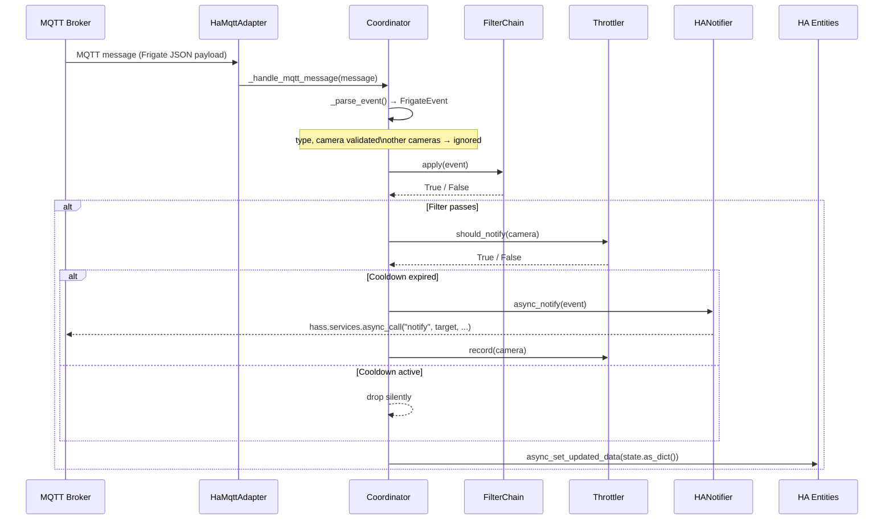

# Architecture — Frigate Event Manager

Home Assistant integration (HACS) written in Python asyncio.
Listens to Frigate events via the native HA MQTT broker, filters, throttles and dispatches to HA notifications and entities.

## Overview

```mermaid
graph TB
    subgraph External["External systems"]
        BROKER[("MQTT Broker")]
        FRIGATE["Frigate NVR"]
        HA_NOTIFY["HA Companion App"]
    end

    subgraph Integration["custom_components/frigate_event_manager"]
        subgraph Domain["domain/ — pure logic, zero HA dependency"]
            MODEL["model.py\nFrigateEvent, CameraState\n_parse_event()"]
            FILTER_D["filter.py\nZoneFilter, LabelFilter\nTimeFilter, FilterChain"]
            THROTTLE_D["throttle.py\nThrottler (injectable clock)"]
            PORTS["ports.py\nNotifierPort\nEventSourcePort\nFrigatePort"]
        end

        COORD["coordinator.py\nFrigateEventManagerCoordinator\n(DataUpdateCoordinator — push MQTT)"]
        HAMQTT["ha_mqtt.py\nHaMqttAdapter\n(EventSourcePort)"]
        NOTIFIER["notifier.py\nHANotifier\n(NotifierPort)"]
        CLIENT["frigate_client.py\nFrigateClient\n(FrigatePort)"]

        subgraph Entities["HA Entities (per camera, via subentry)"]
            SWITCH["switch.py\n1 switch — notifications on/off"]
            BINSENSOR["binary_sensor.py\n2 binary_sensor — motion + active silence"]
            BUTTON["button.py\n2 buttons — silent mode + cancel"]
            SENSOR["sensor.py\n1 sensor — silence end timestamp"]
        end
    end

    BROKER -->|"frigate/reviews (MQTT)"| HAMQTT
    HAMQTT -->|"EventSourcePort"| COORD
    COORD -->|FrigateEvent| FILTER_D
    FILTER_D -->|accepted| THROTTLE_D
    THROTTLE_D -->|cooldown OK| NOTIFIER
    NOTIFIER -->|"notify.<target>"| HA_NOTIFY
    COORD -->|async_set_updated_data| Entities
    SWITCH -->|"set_camera_enabled()"| COORD
    CLIENT -->|"FrigatePort"| FRIGATE

    style External fill:#1a0a0a,stroke:#f85149
    style Integration fill:#0a1a2a,stroke:#58a6ff
    style Domain fill:#0a0a1a,stroke:#a371f7
    style Entities fill:#0a1a2a,stroke:#3fb950
```

## Hexagonal architecture

The project follows the Ports & Adapters pattern. The domain layer (`domain/`) has zero HA dependency and can be tested without mocking any HA internals.

| Layer | Files | Dependencies |
| --- | --- | --- |
| **Domain** (core) | `domain/model.py`, `domain/filter.py`, `domain/throttle.py`, `domain/ports.py` | stdlib only |
| **Application** | `coordinator.py` | domain + ports |
| **Outbound adapters** | `notifier.py`, `ha_mqtt.py`, `frigate_client.py` | HA + aiohttp |
| **Inbound adapters** | `config_flow.py`, `__init__.py`, `switch.py`, `binary_sensor.py`, `button.py`, `sensor.py`, `select.py` | HA |

| Port | Direction | Implementation |
| --- | --- | --- |
| `NotifierPort` | Outbound | `notifier.HANotifier` |
| `EventSourcePort` | Inbound | `ha_mqtt.HaMqttAdapter` |
| `FrigatePort` | Outbound | `frigate_client.FrigateClient` |

## Event data flow

## Config flow (5 steps)

```mermaid
graph LR
    U["user\nFrigate URL\nnotify target"] --> C["configure\ncamera (dropdown)\nMQTT topic"]
    C --> F["configure_filters\nzones, labels\ndisabled hours\nseverity"]
    F --> B["configure_behavior\ncooldown, debounce\nsilent duration\ntap action\naction buttons"]
    B --> N["configure_notifications\ntitle template\nmessage template\ncritical template\nsound + volume"]

    style U fill:#0a1a2a,stroke:#58a6ff
    style C fill:#0a1a2a,stroke:#58a6ff
    style F fill:#0a1a2a,stroke:#58a6ff
    style B fill:#0a1a2a,stroke:#58a6ff
    style N fill:#0a1a2a,stroke:#58a6ff
```

Reconfiguration mirrors steps `configure` → `configure_filters` → `configure_behavior` → `configure_notifications`.

## HA entities per camera

```mermaid
graph LR
    subgraph camera["For each camera (config subentry)"]
        D["switch — Notifications on/off\nunique_id: fem_{cam}_switch"]
        E["binary_sensor — Motion\nunique_id: fem_{cam}_motion"]
        E2["binary_sensor — Active silence\nunique_id: fem_{cam}_silent_state"]
        F["button — Activate silent mode\nunique_id: fem_{cam}_silent"]
        F2["button — Cancel silence\nunique_id: fem_{cam}_cancel_silent"]
        G["sensor — Silence end (timestamp)\nunique_id: fem_{cam}_silent_until"]
    end

    style camera fill:#0a1a2a,stroke:#58a6ff
```

All entities inherit from `CoordinatorEntity` (`has_entity_name=True`).
State is read from `coordinator.data` (dict from `CameraState.as_dict()`).

## Startup sequence

```mermaid
graph TD
    S1["1. async_setup_entry(hass, entry)"]
    S2["2. For each camera subentry\ninstantiate HANotifier + Coordinator"]
    S3["3. coordinator.async_start()\n→ HaMqttAdapter.async_subscribe(topic, callback)"]
    S4["4. async_forward_entry_setups(entry, PLATFORMS)\nswitch / binary_sensor / button / sensor / select"]
    S5["5. Entities created from entry.runtime_data\n(coordinators indexed by subentry_id)"]
    S6["6. HA asyncio loop\n_handle_mqtt_message() on each Frigate event"]

    S1 --> S2 --> S3 --> S4 --> S5 --> S6

    style S3 fill:#0a1a0a,stroke:#3fb950
    style S6 fill:#0a1a2a,stroke:#58a6ff
```

## Filters reference

Each camera subentry defines optional filters. Empty list = accept all.

| Filter | Parameter | Behaviour |
| --- | --- | --- |
| `ZoneFilter` | `zone_multi: list[str]`, `zone_order_enforced: bool` | All required zones present (ordered subsequence if `zone_order_enforced=True`) |
| `LabelFilter` | `labels: list[str]` | At least one event object in the list |
| `TimeFilter` | `disabled_hours: list[int]` | Blocks if current local hour is in `disabled_hours` |
| `SeverityFilter` | `severity: str` | `"alert"` only, `"detection"` only, or both |
| `FilterChain` | `filters: list[Filter]` | `all()` with short-circuit on first rejection |

Zones and labels are populated from the Frigate API (`GET /api/config`); CSV free-text is used as fallback if Frigate is unreachable during setup.

## Notification templates

Title, message and critical condition are [Jinja2 templates](https://www.home-assistant.io/docs/configuration/templating/).

→ Full variable reference and examples: [`docs/notifications.md`](notifications.md)
