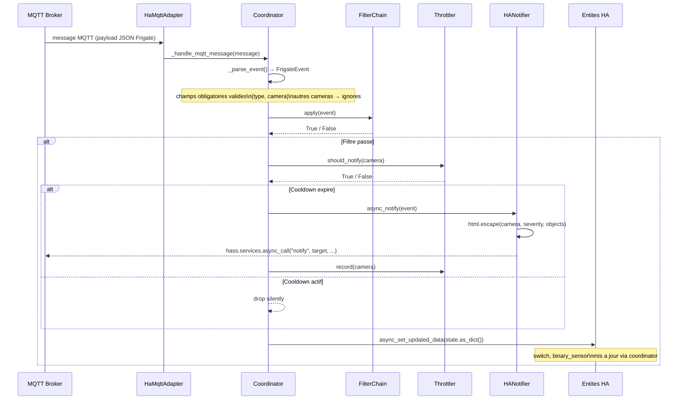

# Architecture — Frigate Event Manager

Intégration Home Assistant (HACS) écrite en Python asyncio.
Écoute les événements Frigate via le broker MQTT natif HA, filtre, throttle et dispatche vers les notifications et les entités HA.

## Vue d'ensemble

```mermaid
graph TB
    subgraph External["Systemes externes"]
        BROKER[("MQTT Broker")]
        FRIGATE["Frigate NVR"]
        HA_NOTIFY["HA Companion App"]
    end

    subgraph Integration["custom_components/frigate_event_manager"]
        subgraph Domain["domain/ — logique pure, zero dependance HA"]
            MODEL["model.py\nFrigateEvent, CameraState\n_parse_event()"]
            FILTER_D["filter.py\nZoneFilter, LabelFilter\nTimeFilter, FilterChain"]
            THROTTLE_D["throttle.py\nThrottler (clock injectable)"]
            PORTS["ports.py\nNotifierPort\nEventSourcePort\nFrigatePort"]
        end

        COORD["coordinator.py\nFrigateEventManagerCoordinator\n(DataUpdateCoordinator — push MQTT)"]
        HAMQTT["ha_mqtt.py\nHaMqttAdapter\n(EventSourcePort)"]
        NOTIFIER["notifier.py\nHANotifier\n(NotifierPort)"]
        CLIENT["frigate_client.py\nFrigateClient\n(FrigatePort)"]

        subgraph Entities["Entites HA (par camera, via subentry)"]
            SWITCH["switch.py\n1 switch — notifications"]
            BINSENSOR["binary_sensor.py\n1 binary_sensor — mouvement"]
        end
    end

    BROKER -->|"frigate/reviews (MQTT)"| HAMQTT
    HAMQTT -->|"EventSourcePort"| COORD
    COORD -->|FrigateEvent| FILTER_D
    FILTER_D -->|accepte| THROTTLE_D
    THROTTLE_D -->|cooldown OK| NOTIFIER
    NOTIFIER -->|"notify.<target>"| HA_NOTIFY
    COORD -->|async_set_updated_data| Entities
    SWITCH -->|"set_camera_enabled()"| COORD
    CLIENT -->|"FrigatePort"| FRIGATE

    style External fill:#1a0a0a,stroke:#f85149
    style Integration fill:#0a1a2a,stroke:#58a6ff
    style Domain fill:#0a0a1a,stroke:#a371f7
    style Entities fill:#0a1a1a,stroke:#3fb950
```

## Architecture Hexagonale

Le projet suit le pattern Ports & Adaptateurs :

| Couche | Fichiers | Dépendances |
| --- | --- | --- |
| **Domain** (noyau) | `domain/model.py`, `domain/filter.py`, `domain/throttle.py`, `domain/ports.py` | stdlib uniquement |
| **Application** | `coordinator.py` | domain + ports |
| **Adaptateurs sortants** | `notifier.py`, `ha_mqtt.py`, `frigate_client.py` | HA + aiohttp |
| **Adaptateurs entrants** | `config_flow.py`, `__init__.py`, `switch.py`, `binary_sensor.py` | HA |

### Ports déclarés (`domain/ports.py`)

| Port | Sens | Implémentation |
| --- | --- | --- |
| `NotifierPort` | Sortant | `notifier.HANotifier` |
| `EventSourcePort` | Entrant | `ha_mqtt.HaMqttAdapter` |
| `FrigatePort` | Sortant | `frigate_client.FrigateClient` |

## Flux de données

## Composants

### coordinator.py — FrigateEventManagerCoordinator

`DataUpdateCoordinator` en mode push MQTT uniquement (`update_interval=None`). Un coordinator par caméra (via subentry).

- **`async_start()`** : souscrit au topic MQTT via `EventSourcePort.async_subscribe()`. L'adaptateur HA (`HaMqttAdapter`) est injecté par défaut ; un adaptateur de test peut être injecté en paramètre.
- **`async_stop()`** : désabonnement propre, appelé depuis `async_unload_entry`.
- **`_handle_mqtt_message()`** : callback MQTT (`@callback`), parse le payload, met à jour `CameraState`, notifie les entités via `async_set_updated_data`.
- **`set_camera_enabled()`** : mutation du flag `enabled`, déclenché par le switch HA.

Dataclasses exposées :

| Dataclass | Champs clés |
| --- | --- |
| `FrigateEvent` | `type`, `camera`, `severity`, `objects`, `zones`, `score`, `thumb_path`, `review_id`, `start_time`, `end_time` |
| `CameraState` | `name`, `last_severity`, `last_objects`, `last_event_time`, `motion`, `enabled` |

### domain/filter.py — FilterChain

Protocole `Filter` (méthode `apply(event) → bool`). Convention : liste vide = tout accepter.

| Filtre | Paramètre | Comportement |
| --- | --- | --- |
| `ZoneFilter` | `zone_multi: list[str]`, `zone_order_enforced: bool` | Toutes les zones requises présentes (ou sous-séquence ordonnée si `zone_order_enforced=True`) |
| `LabelFilter` | `labels: list[str]` | Au moins un objet de l'événement dans la liste |
| `TimeFilter` | `disabled_hours: list[int]`, `clock: Callable` | Bloque si l'heure locale courante est dans `disabled_hours`. Clock injectable pour les tests. |
| `FilterChain` | `filters: list[Filter]` | `all()` avec court-circuit au premier refus |

### domain/throttle.py — Throttler

Anti-spam par caméra, séparation décision / enregistrement.

- **`should_notify(camera, now)`** : lecture seule — retourne True si aucune notification précédente ou cooldown écoulé.
- **`record(camera, now)`** : seul point de mutation — enregistre le timestamp de la dernière notification.
- Clock injectable pour les tests. Cooldown configurable via `DEFAULT_THROTTLE_COOLDOWN` (défaut : 60 s).

### notifier.py — HANotifier

Notifications HA Companion via `hass.services.async_call("notify", target, ...)`.

- `html.escape()` sur tous les champs dynamiques issus du payload Frigate.
- Gère `persistent_notification` ET les services `notify.xxx` (mobile, etc.).

### ha_mqtt.py — HaMqttAdapter

Adaptateur `EventSourcePort` — encapsule `mqtt.async_subscribe` de HA. Remplaçable par un fake dans les tests.

### frigate_client.py — FrigateClient

Client HTTP asyncio pour l'API REST Frigate (liste des caméras). Implémente `FrigatePort` par duck typing.

## Entités HA par caméra

```mermaid
graph LR
    subgraph camera["Pour chaque camera (subentry)"]
        D["switch — Notifications\nunique_id: fem_{cam}_switch"]
        E["binary_sensor — Mouvement\nunique_id: fem_{cam}_motion\ndevice_class: motion"]
    end

    style camera fill:#0a1a2a,stroke:#58a6ff
```

Toutes les entités héritent de `CoordinatorEntity` et ont `has_entity_name=True`.
Les données sont lues depuis `coordinator.data` (dict sérialisé par `CameraState.as_dict()`).

## Séquence de démarrage

```mermaid
graph TD
    S1["1. async_setup_entry(hass, entry)"]
    S2["2. Pour chaque subentry camera :\n   instancier HANotifier + FrigateEventManagerCoordinator"]
    S3["3. coordinator.async_start()\n   → HaMqttAdapter.async_subscribe(topic, callback)"]
    S4["4. async_forward_entry_setups(entry, PLATFORMS)\n   switch / binary_sensor"]
    S5["5. Entités créées depuis entry.runtime_data\n   (coordinators par subentry_id)"]
    S6["6. Boucle asyncio HA\n   _handle_mqtt_message() sur chaque event"]

    S1 --> S2 --> S3 --> S4 --> S5 --> S6

    style S3 fill:#0a1a0a,stroke:#3fb950
    style S6 fill:#0a1a2a,stroke:#58a6ff
```

## Filtres configurables par caméra

Chaque subentry camera peut définir des filtres optionnels, saisis en CSV dans le config flow :

| Clé (`const.py`) | Type stocké | Comportement si vide |
| --- | --- | --- |
| `CONF_ZONES` | `list[str]` | Toutes zones acceptées |
| `CONF_LABELS` | `list[str]` | Tous objets acceptés |
| `CONF_DISABLED_HOURS` | `list[int]` | Aucune heure bloquée |
