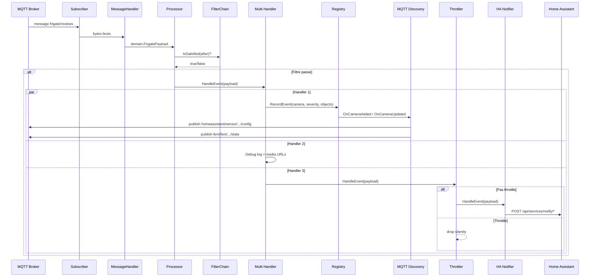

# Architecture — Frigate Event Manager

## Vue d'ensemble

```mermaid
graph TB
    subgraph External["Systemes externes"]
        BROKER[("MQTT Broker<br/>Mosquitto")]
        FRIGATE["Frigate NVR"]
        HA["Home Assistant"]
        BROWSER["Navigateur"]
    end

    subgraph Addon["Frigate Event Manager"]
        subgraph Adapters["Adapters (monde exterieur)"]
            MQTT_SUB["MQTT Subscriber"]
            MQTT_DISCO["MQTT Discovery<br/>Publisher"]
            CONFIG["Config<br/>/data/options.json"]
            FRIGATE_CLIENT["Frigate Client<br/>HTTP + JWT"]
            API_SERVER["API Server<br/>:5555"]
            SIGNER["Signer<br/>HMAC-SHA256"]
            HA_NOTIFIER["HA Notifier"]
            DEBUG["Debug Handler"]
            SUPERVISOR["Supervisor Client"]
        end

        subgraph Core["Core (logique metier)"]
            PORTS{{"Ports<br/>EventProcessor<br/>EventHandler<br/>MediaSigner"}}
            PROCESSOR["Processor"]
            FILTER["FilterChain<br/>SeverityFilter"]
            MULTI["Multi Handler"]
            THROTTLE["Throttler<br/>cooldown/debounce"]
            REGISTRY["Registry<br/>cameras + persistence"]
        end

        subgraph Domain["Domain"]
            PAYLOAD["FrigatePayload<br/>EventState<br/>EventData"]
        end

        PERSISTENCE[("/data/state.json")]
    end

    BROKER -->|frigate/reviews| MQTT_SUB
    MQTT_SUB -->|bytes -> JSON| PROCESSOR
    PROCESSOR -->|filtre| FILTER
    PROCESSOR -->|dispatch| MULTI
    MULTI -->|"1"| REGISTRY
    MULTI -->|"2"| DEBUG
    MULTI -->|"3"| THROTTLE
    THROTTLE --> HA_NOTIFIER
    REGISTRY -->|listener| MQTT_DISCO
    REGISTRY -->|persist| PERSISTENCE
    MQTT_DISCO -->|publish| BROKER
    HA_NOTIFIER -->|POST /api/services| HA
    API_SERVER -->|proxy| FRIGATE_CLIENT
    FRIGATE_CLIENT -->|HTTP| FRIGATE
    API_SERVER -->|presign| SIGNER
    BROWSER -->|presigned URL| API_SERVER
    SUPERVISOR -->|ingress URL| HA
    CONFIG -->|load| PROCESSOR

    style External fill:#1a0a0a,stroke:#f85149
    style Core fill:#0a1a2a,stroke:#58a6ff
    style Adapters fill:#0a1a0a,stroke:#3fb950
    style Domain fill:#1a1a0a,stroke:#d29922
```



## Flux de donnees



## Structure des packages

```mermaid
graph LR
    subgraph domain["domain"]
        FP["FrigatePayload"]
        ES["EventState"]
        ED["EventData"]
    end

    subgraph ports["core/ports"]
        EP["EventProcessor"]
        EH["EventHandler"]
        MS["MediaSigner"]
    end

    subgraph core["core/"]
        PROC["processor.Processor<br/>impl EventProcessor"]
        FILT["filter.FilterChain<br/>+ SeverityFilter"]
        MULTI_H["handler.Multi<br/>impl EventHandler"]
        THROT["throttle.Throttler<br/>impl EventHandler"]
        REG["registry.Registry"]
        REG_H["registry.Handler<br/>impl EventHandler"]
        LIS{{"registry.Listener"}}
    end

    subgraph adapters["adapter/"]
        MQTT_S["mqtt.Subscriber"]
        MQTT_MH["mqtt.MessageHandler"]
        MQTT_CMD{{"mqtt.CommandHandler"}}
        DISCO_PUB["mqttdiscovery.Publisher<br/>impl Listener"]
        DISCO_SW["mqttdiscovery.SwitchCmdHandler<br/>impl CommandHandler"]
        DISCO_AD["mqttdiscovery.AutopahoAdapter"]
        FRIG["frigate.Client"]
        API_SRV["api.Server"]
        API_SIG["api.Signer<br/>impl MediaSigner"]
        HA_NOT["homeassistant.Notifier<br/>impl EventHandler"]
        DBG["debughandler.Handler<br/>impl EventHandler"]
        CFG["config.Config"]
        SUP["supervisor.FetchIngressInfo"]
    end

    MQTT_MH -->|utilise| EP
    PROC -->|utilise| FILT
    PROC -->|utilise| EH
    MULTI_H -->|impl| EH
    THROT -->|wraps| EH
    REG_H -->|impl| EH
    HA_NOT -->|impl| EH
    DBG -->|impl| EH
    API_SIG -->|impl| MS
    DISCO_PUB -->|impl| LIS
    DISCO_SW -->|impl| MQTT_CMD
    REG -->|notifie| LIS
    REG_H -->|alimente| REG

    style domain fill:#1a1a0a,stroke:#d29922
    style ports fill:#1a0a2a,stroke:#bc8cff
    style core fill:#0a1a2a,stroke:#58a6ff
    style adapters fill:#0a1a0a,stroke:#3fb950
```



## MQTT Discovery — Entites creees par camera

```mermaid
graph LR
    subgraph camera["Pour chaque camera decouverte"]
        A["sensor.fem_{cam}_last_alert<br/>device_class: timestamp"]
        B["sensor.fem_{cam}_last_object<br/>icon: mdi:eye"]
        C["sensor.fem_{cam}_event_count<br/>state_class: measurement"]
        D["sensor.fem_{cam}_severity<br/>icon: mdi:shield-alert"]
        E["switch.fem_{cam}_notifications<br/>icon: mdi:bell"]
    end

    subgraph topics["Topics MQTT"]
        TC["homeassistant/sensor/fem_{cam}_*/config<br/>(retain, JSON config)"]
        TS["fem/fem/{cam}/*<br/>(retain, valeur)"]
        CMD["fem/fem/{cam}/notifications/set<br/>(commande ON/OFF)"]
    end

    camera --> TC
    camera --> TS
    CMD -->|SwitchCommandHandler| E

    style camera fill:#0a1a2a,stroke:#58a6ff
    style topics fill:#0a1a0a,stroke:#3fb950
```



## Sequence de demarrage

```mermaid
graph TD
    S1["1. Config.Load(/data/options.json)"]
    S2["2. Registry.Load(/data/state.json)<br/>restaure cameras + prefs"]
    S3["3. Supervisor.FetchIngressInfo()<br/>resout URL ingress"]
    S4["4. Frigate Client + Signer + API Server<br/>(si configure)"]
    S5["5. Multi Handler<br/>+ registry + debug + throttle(notifier)"]
    S6["6. FilterChain -> Processor -> MessageHandler"]
    S7["7. MQTT Subscriber + SwitchCommandHandler"]
    S8["8. subscriber.Connect(ctx)<br/>connexion broker"]
    S9["9. MQTT Discovery Publisher<br/>PublishAll(cameras connues)"]
    S10["10. subscriber.Wait(ctx)<br/>BLOQUANT"]
    S11["11. Cleanup (signer.Stop)"]

    S1 --> S2 --> S3 --> S4 --> S5 --> S6 --> S7 --> S8 --> S9 --> S10 --> S11

    style S8 fill:#1a0a0a,stroke:#f85149
    style S10 fill:#1a0a0a,stroke:#f85149
    style S9 fill:#0a1a0a,stroke:#3fb950
```



## Persistence

| Fichier | Contenu | Quand |
| --- | --- | --- |
| `/data/options.json` | Configuration utilisateur (MQTT, Frigate, filtres...) | Lu au boot, genere par HA |
| `/data/state.json` | Cameras decouvertes, prefs on/off, derniers events | Lu au boot, ecrit a chaque event |

```json
// Exemple /data/state.json
{
  "cameras": {
    "jardin_nord": {
      "enabled": true,
      "first_seen": "2025-01-01T10:00:00Z",
      "last_event_time": "2025-01-01T14:32:00Z",
      "last_severity": "alert",
      "last_objects": ["person"]
    },
    "garage": {
      "enabled": false,
      "first_seen": "2025-01-01T11:00:00Z",
      "last_event_time": "2025-01-01T12:00:00Z",
      "last_severity": "detection",
      "last_objects": ["car"]
    }
  }
}
```
