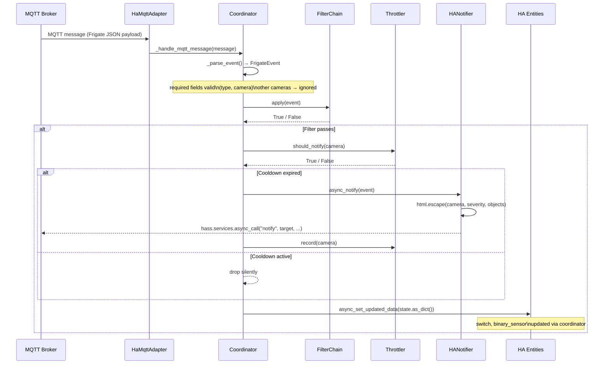

# Architecture — Frigate Event Manager

Home Assistant integration (HACS) written in Python asyncio.
Listens to Frigate events via the native HA MQTT broker, filters, throttles and dispatches to HA notifications and entities.

## Overview

```mermaid
graph TB
    subgraph External["External systems"]
        BROKER[("MQTT Broker")]
        FRIGATE["Frigate NVR"]
        HA_NOTIFY["HA Companion App"]
    end

    subgraph Integration["custom_components/frigate_event_manager"]
        subgraph Domain["domain/ — pure logic, zero HA dependency"]
            MODEL["model.py\nFrigateEvent, CameraState\n_parse_event()"]
            FILTER_D["filter.py\nZoneFilter, LabelFilter\nTimeFilter, FilterChain"]
            THROTTLE_D["throttle.py\nThrottler (injectable clock)"]
            PORTS["ports.py\nNotifierPort\nEventSourcePort\nFrigatePort"]
        end

        COORD["coordinator.py\nFrigateEventManagerCoordinator\n(DataUpdateCoordinator — push MQTT)"]
        HAMQTT["ha_mqtt.py\nHaMqttAdapter\n(EventSourcePort)"]
        NOTIFIER["notifier.py\nHANotifier\n(NotifierPort)"]
        CLIENT["frigate_client.py\nFrigateClient\n(FrigatePort)"]

        subgraph Entities["HA Entities (per camera, via subentry)"]
            SWITCH["switch.py\n1 switch — notifications"]
            BINSENSOR["binary_sensor.py\n2 binary_sensor — motion + active silence"]
            BUTTON["button.py\n1 button — silent mode"]
            SENSOR["sensor.py\n1 sensor — silence end timestamp"]
        end
    end

    BROKER -->|"frigate/reviews (MQTT)"| HAMQTT
    HAMQTT -->|"EventSourcePort"| COORD
    COORD -->|FrigateEvent| FILTER_D
    FILTER_D -->|accepted| THROTTLE_D
    THROTTLE_D -->|cooldown OK| NOTIFIER
    NOTIFIER -->|"notify.<target>"| HA_NOTIFY
    COORD -->|async_set_updated_data| Entities
    SWITCH -->|"set_camera_enabled()"| COORD
    CLIENT -->|"FrigatePort"| FRIGATE

    style External fill:#1a0a0a,stroke:#f85149
    style Integration fill:#0a1a2a,stroke:#58a6ff
    style Domain fill:#0a0a1a,stroke:#a371f7
    style Entities fill:#0a1a1a,stroke:#3fb950
```



## Hexagonal Architecture

The project follows the Ports & Adapters pattern:

| Layer | Files | Dependencies |
| --- | --- | --- |
| **Domain** (core) | `domain/model.py`, `domain/filter.py`, `domain/throttle.py`, `domain/ports.py` | stdlib only |
| **Application** | `coordinator.py` | domain + ports |
| **Outbound adapters** | `notifier.py`, `ha_mqtt.py`, `frigate_client.py` | HA + aiohttp |
| **Inbound adapters** | `config_flow.py`, `__init__.py`, `switch.py`, `binary_sensor.py`, `button.py`, `sensor.py` | HA |

### Declared ports (`domain/ports.py`)

| Port | Direction | Implementation |
| --- | --- | --- |
| `NotifierPort` | Outbound | `notifier.HANotifier` |
| `EventSourcePort` | Inbound | `ha_mqtt.HaMqttAdapter` |
| `FrigatePort` | Outbound | `frigate_client.FrigateClient` |

## Data flow



## Components

### coordinator.py — FrigateEventManagerCoordinator

`DataUpdateCoordinator` in push-only MQTT mode (`update_interval=None`). One coordinator per camera (via subentry).

- **`async_start()`**: subscribes to the MQTT topic via `EventSourcePort.async_subscribe()`. The HA adapter (`HaMqttAdapter`) is injected by default; a test adapter can be injected as a parameter.
- **`async_stop()`**: clean unsubscription, called from `async_unload_entry`.
- **`_handle_mqtt_message()`**: MQTT callback (`@callback`), parses the payload, updates `CameraState`, notifies entities via `async_set_updated_data`.
- **`set_camera_enabled()`**: mutates the `enabled` flag, triggered by the HA switch.

Exposed dataclasses:

| Dataclass | Key fields |
| --- | --- |
| `FrigateEvent` | `type`, `camera`, `severity`, `objects`, `zones`, `score`, `thumb_path`, `review_id`, `start_time`, `end_time` |
| `CameraState` | `name`, `last_severity`, `last_objects`, `last_event_time`, `motion`, `enabled` |

### domain/filter.py — FilterChain

`Filter` protocol (method `apply(event) → bool`). Convention: empty list = accept all.

| Filter | Parameter | Behaviour |
| --- | --- | --- |
| `ZoneFilter` | `zone_multi: list[str]`, `zone_order_enforced: bool` | All required zones present (or ordered subsequence if `zone_order_enforced=True`) |
| `LabelFilter` | `labels: list[str]` | At least one event object in the list |
| `TimeFilter` | `disabled_hours: list[int]`, `clock: Callable` | Blocks if the current local hour is in `disabled_hours`. Injectable clock for tests. |
| `FilterChain` | `filters: list[Filter]` | `all()` with short-circuit on first rejection |

### domain/throttle.py — Throttler

Per-camera anti-spam, decision / recording separation.

- **`should_notify(camera, now)`**: read-only — returns True if no previous notification or cooldown elapsed.
- **`record(camera, now)`**: sole mutation point — records the timestamp of the last notification.
- Injectable clock for tests. Configurable cooldown via `DEFAULT_THROTTLE_COOLDOWN` (default: 60 s).

### notifier.py — HANotifier

HA Companion notifications via `hass.services.async_call("notify", target, ...)`.

- `html.escape()` on all dynamic fields from the Frigate payload.
- Handles `persistent_notification` AND `notify.xxx` services (mobile, etc.).
- Jinja2 templates for title and message (`CONF_NOTIF_TITLE`, `CONF_NOTIF_MESSAGE`).
- Critical notification (`CONF_CRITICAL_TEMPLATE`): iOS `push.sound.critical` + Android `channel`.

**Variables available in templates:**

| Variable | Type | Description |
| --- | --- | --- |
| `camera` | `str` | Camera name |
| `objects` | `list[str]` | Detected objects (e.g. `["person", "dog"]`) |
| `label` | `str` | First detected object |
| `zones` | `list[str]` | Zones involved |
| `severity` | `str` | `"alert"` or `"detection"` |
| `score` | `float` | Confidence score (0.0–1.0) |
| `start_time` | `float` | UNIX timestamp of event start |
| `review_id` | `str` | Frigate review identifier |

**Examples:**

```jinja2
{# Title #}
🚨 {{ camera | title }} — {{ objects | join(', ') }}

{# Message #}
{{ severity | upper }} at {{ start_time | timestamp_custom('%H:%M') }} · {{ zones | join(', ') }}

{# Critical condition (night only) #}
{{ now().hour >= 22 or now().hour < 7 }}
```

### ha_mqtt.py — HaMqttAdapter

`EventSourcePort` adapter — wraps HA's `mqtt.async_subscribe`. Replaceable by a fake in tests.

### frigate_client.py — FrigateClient

Async HTTP client for the Frigate REST API. Implements `FrigatePort` via duck typing.

- **`get_cameras()`**: returns the list of camera names from `GET /api/config`.
- **`get_camera_config(camera)`**: returns zones and labels configured for a camera from `GET /api/config`. Used by the config flow to populate multi-selects.
- **`get_media(path)`**: fetches a media file (image, clip, preview) with authentication.

All methods support Frigate 0.14+ JWT authentication via `POST /api/login`.

## HA entities per camera

```mermaid
graph LR
    subgraph camera["For each camera (subentry)"]
        D["switch — Notifications\nunique_id: fem_{cam}_switch"]
        E["binary_sensor — Motion\nunique_id: fem_{cam}_motion\ndevice_class: motion"]
        E2["binary_sensor — Active silence\nunique_id: fem_{cam}_silent_state\ndevice_class: running"]
        F["button — Silent mode\nunique_id: fem_{cam}_silent"]
        F2["button — Cancel silence\nunique_id: fem_{cam}_cancel_silent"]
        G["sensor — Silence end\nunique_id: fem_{cam}_silent_until\ndevice_class: timestamp"]
    end

    style camera fill:#0a1a2a,stroke:#58a6ff
```



All entities inherit from `CoordinatorEntity` and have `has_entity_name=True`.
Data is read from `coordinator.data` (dict serialised by `CameraState.as_dict()`).

## Startup sequence

```mermaid
graph TD
    S1["1. async_setup_entry(hass, entry)"]
    S2["2. For each camera subentry:\n   instantiate HANotifier + FrigateEventManagerCoordinator"]
    S3["3. coordinator.async_start()\n   → HaMqttAdapter.async_subscribe(topic, callback)"]
    S4["4. async_forward_entry_setups(entry, PLATFORMS)\n   switch / binary_sensor / button / sensor"]
    S5["5. Entities created from entry.runtime_data\n   (coordinators by subentry_id)"]
    S6["6. HA asyncio loop\n   _handle_mqtt_message() on each event"]

    S1 --> S2 --> S3 --> S4 --> S5 --> S6

    style S3 fill:#0a1a0a,stroke:#3fb950
    style S6 fill:#0a1a2a,stroke:#58a6ff
```



## Configurable filters per camera

Each camera subentry can define optional filters in the config flow.
Zones and labels are offered as **multi-select** from the Frigate API (`GET /api/config`);
if Frigate is unreachable during configuration, a free-text field (CSV format) is used as a fallback.
Blocked hours are always entered via multi-select (0–23).

| Key (`const.py`) | Stored type | Input mode | Behaviour if empty |
| --- | --- | --- | --- |
| `CONF_ZONES` | `list[str]` | Frigate API multi-select (CSV fallback) | All zones accepted |
| `CONF_LABELS` | `list[str]` | Frigate API multi-select (CSV fallback) | All objects accepted |
| `CONF_DISABLED_HOURS` | `list[int]` | Multi-select 0–23 | No hours blocked |
